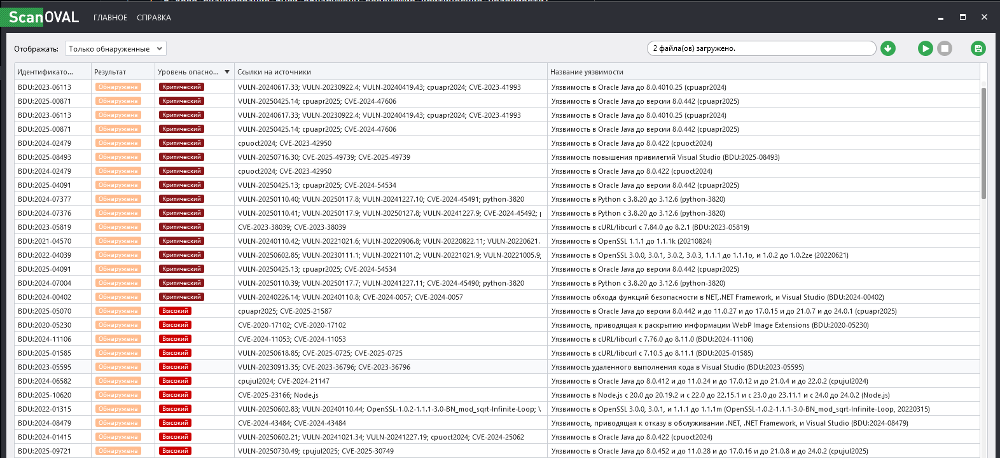

1. **Было проведено сканирование системы под управлением OS Windows 11 (Windows 11 Home, 24H2) с помощью инструмента ScanOVAL версии 1.5.0**
2. **В ходе сканирования были обнаружены следующие критические уязвимости:**  
    
3. **Было принято решение устранить уязвимость CVE-2024-45490**  
  
4. **Объяснение по уязвимости CVE-2024-45490:**  
  4.1. Уязвимость в **Python** с 3.8.20 до 3.12.6.  
  4.2. **Описание**: В библиотеке libexpat до версии 2.6.3 обнаружена проблема, из-за которой функция xmlparse.c не отклоняет отрицательную длину для XML_ParseBuffer.  
  4.3. Уязвимость CVE-2024-45490 является критической (базовый балл CVSS **9.8**). Она затрагивает **libexpat** — широко используемую библиотеку для разбора XML. Злоумышленник может использовать специально созданный XML-документ, чтобы вызвать сбой в работе приложения или, потенциально, выполнить произвольный код.  
  4.4. **Контекст**:  
    `C:\Program Files\LibreOffice\program\python3.dll`  
    `C:\Program Files\LibreOffice\program\python310.dll`  
    Это означает, что уязвимая версия Python (которая, в свою очередь, использует уязвимую версию libexpat) не является системной установкой Python, а является компонентом, встроенным в пакет LibreOffice.  
    Таким образом, проблема находится в цепочке зависимостей: LibreOffice → Python → libexpat.  
5. **Решение:** Обновить LibreOffice до версии, в которой используется исправленная версия Python (3.12.6 или новее).  
6. **Текущая версия LibreOffice:** 25.2.5. Обновление до 25.8.0 (или новее) устранит уязвимость.