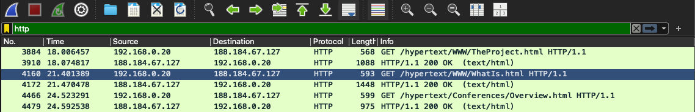
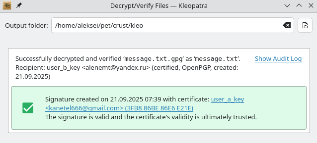
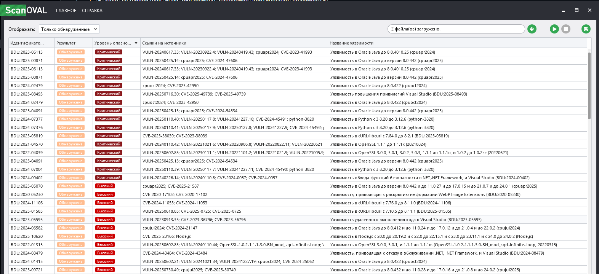
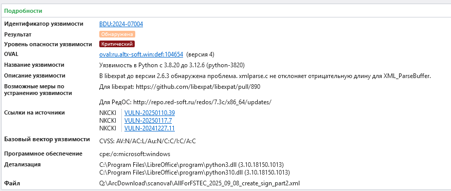

# Общий отчет по лабораторным работам

## 1. Шифр двойной перестановки

*   **OS**: NixOS 25.05
*   **Language/application**: Rust 1.89.0
*   **Description**: Реализован алгоритм шифрования методом двойной перестановки. Идея заключается в том, чтобы записывать исходный текст в матрицу в соответствии с одним ключом (ключ записи), а считывать — в соответствии с другим (ключ чтения). Программа содержит функции для шифрования и дешифрования текста.
*   **Code**: 
```rust
fn cypher(read_key: &str, write_key: &str, plaintext: &str) -> String {
  let mut s = String::from("");
  let size: usize = read_key.chars().count();

  for i in read_key.chars() {
    if let Some(i) = i.to_digit(10) {
      for j in write_key.chars() {
        if let Some(j) = j.to_digit(10) {
          let index = (i as usize - 1) + (j as usize - 1) * size as usize;

          // println!("i = {}, j = {}, index = {}", i, j, index);

          if let Some(char_to_push) = plaintext.chars().nth(index) {
            s.push(char_to_push);
          }
        }
        println!("{}", s);
      } 
    }
    // println!("--- {} ---", i);
  }

  return s;
}

fn decypher(read_key: &str, write_key: &str, cyphered_text: &str) -> String {
  let mut s = String::from("");
  let size: usize = read_key.chars().count();

  let mut reposition: String = String::from("");
  for i in 1..=size {
    reposition.push_str(&i.to_string());
  }

  for i in reposition.chars() {
    if let Some(i) = i.to_digit(10) {

      for j in reposition.chars() {
        if let Some(j) = j.to_digit(10) {
          let read_index = read_key.chars().position(|c| c == char::from_digit(j, 10).unwrap());
          let write_index = write_key.chars().position(|c| c == char::from_digit(i, 10).unwrap());

          if let Some(read_index) = read_index {
            if let Some(write_index) = write_index {
              // println!("read_i - {}, write_i - {}", read_index, write_index);

              let index = (write_index) + (read_index) * size as usize;

              if let Some(char_to_push) = cyphered_text.chars().nth(index) {
                s.push(char_to_push);
              }
            }
          }
        }
        println!("{}", s);
      }
    }
  }
  return s;
}

fn main() {
  let plaintext: &str = "ШИФРОВАНИЕ_ПЕРЕСТАНОВКОЙ_";
  // let read_key: &str = "35214";
  // let write_key: &str = "43251";
  let read_key: &str = "24135";
  let write_key: &str = "52134";

  let cypheredtext: String = cypher(read_key, write_key, plaintext);
  println!("Cyphered text is: {} \n", cypheredtext);

  println!("Decyphered text is: {}", decypher(read_key, write_key, &cypheredtext));
}
```

## 2. Шифр Виженера

*   **OS**: NixOS 25.05
*   **Language/application**: Rust 1.89.0
*   **Description**: Реализован полиалфавитный шифр Виженера. Для шифрования используется ключевое слово, где каждая буква ключа определяет сдвиг для соответствующей буквы текста. Символы, не являющиеся буквами, игнорируются. Реализованы функции как для шифрования, так и для дешифрования.
*   **Code**: 
```rust
fn shift(c: char, key_char: char, direction: i32) -> char {
    const ALPHABET_LEN: i32 = 26;
    // This implementation only works for uppercase English letters.
    if c.is_ascii_uppercase() && key_char.is_ascii_uppercase() {
        let c_val = c as i32 - 'A' as i32;
        let key_val = key_char as i32 - 'A' as i32;

        // The core formula: (Value + (direction * Key)) mod 26
        let new_val = (c_val + direction * key_val + ALPHABET_LEN) % ALPHABET_LEN;

        // Convert the new value back to a character.
        (new_val as u8 + b'A') as char
    } else {
        // If the character is not an uppercase letter, return it unchanged.
        c
    }
}

/// Encrypts text using the Vigenère cipher.
/// Non-alphabetic characters are passed through unchanged.
pub fn encrypt(plaintext: &str, key: &str) -> String {
    if key.is_empty() || !key.chars().all(|c| c.is_ascii_alphabetic()) {
        println!("Warning: Key must be non-empty and contain only alphabetic characters.");
        return plaintext.to_string();
    }

    // Create an iterator that cycles through the key's characters, converted to uppercase.
    let mut key_chars = key.chars().map(|c| c.to_ascii_uppercase()).cycle();

    plaintext
        .chars()
        .map(|c| {
            // The key iterator only advances when we encrypt an alphabetic character.
            if c.is_ascii_alphabetic() {
                shift(c.to_ascii_uppercase(), key_chars.next().unwrap(), 1)
            } else {
                c
            }
        })
        .collect()
}

/// Decrypts text encrypted with the Vigenère cipher.
pub fn decrypt(ciphertext: &str, key: &str) -> String {
    if key.is_empty() || !key.chars().all(|c| c.is_ascii_alphabetic()) {
        println!("Warning: Key must be non-empty and contain only alphabetic characters.");
        return ciphertext.to_string();
    }

    let mut key_chars = key.chars().map(|c| c.to_ascii_uppercase()).cycle();

    ciphertext
        .chars()
        .map(|c| {
            if c.is_ascii_alphabetic() {
                shift(c.to_ascii_uppercase(), key_chars.next().unwrap(), -1)
            } else {
                c
            }
        })
        .collect()
}

fn main() {
    let key = "AMEBA";
    let plaintext = "SHIFROVANIE";

    println!("Plaintext:  {}", plaintext);
    println!("Key:        {}", key);

    let encrypted_text = encrypt(plaintext, key);
    println!("Encrypted:  {}", encrypted_text);

    let decrypted_text = decrypt(&encrypted_text, key);
    println!("Decrypted:  {}", decrypted_text);

    assert_eq!(plaintext, decrypted_text);
    println!("Encryption and decryption successful!");
}
```

## 3. Алгоритм RSA

*   **OS**: NixOS 25.05
*   **Language/application**: Rust 1.89.0
*   **Description**: Реализован криптографический алгоритм с открытым ключом RSA. Программа генерирует пару ключей (открытый и закрытый) на основе двух простых чисел. Алгоритм включает функции для генерации ключей, шифрования текстового сообщения и его последующего дешифрования.
*   **Code**: 
```rust
fn gcd(mut a: usize, mut b: usize) -> usize {
  while a != 0 && b !=0 {
    if a > b {
      a = a % b;
    } else {
      b = b % a;
    }
  }

  return a + b
}

fn extended_gcd(a: isize, b: isize) -> (isize, isize, isize) {
  if a == 0 {
    return (b, 0, 1);
  } else {
    let (gcd, x1, y1) = extended_gcd(b % a, a);
    let x = y1 - (b / a) * x1;
    let y = x1;
    return (gcd, x, y);
  }
}

fn inverse_mod(a: isize, m: isize) -> isize {
  let (g, x, _) = extended_gcd(a, m);
  if g != 1 {
    panic!("Inverse doesn't exist");
  }
  return (x % m + m) % m;
}

fn rsa_generate(mut p: usize, mut q: usize) -> ((usize, usize), (usize, usize)) {
  let n: usize = p*q;

  let phi: usize = (p - 1) * (q - 1);

  let mut possible_coprimes: Vec<usize> = Vec::new();

  for num in 2..phi {
    let gcd_r: usize = gcd(phi, num);
    if gcd_r == 1 {
      possible_coprimes.push(num);
    }
  }
  println!("possible_coprimes are: {:?}", possible_coprimes);

  let e: usize = match possible_coprimes.iter().min() {
    Some(min) => {
      println!("min is: {}", min);
      *min
    },
    None => {
      println!("No coprimes found");
      0
    },
  };

  // let d: usize = e.powi(-1) as usize % phi;
  let d: usize = inverse_mod(e as isize, phi as isize) as usize;

  return ((e, n), (d, n));
}

fn rsa_cypher(m: &str, key: (usize, usize)) -> Vec<usize> {
  let (e, n) = key;
  m.bytes().map(|byte| {
    let m_val: usize = byte as usize;
    // let c_val: usize = m_val.pow(e as u32) % n;
    let c_val: usize = mod_pow(m_val, e, n);
    return c_val;
  }).collect()
}

fn rsa_decypher(m: Vec<usize>, key: (usize, usize)) -> String {
  let (d, n) = key;
  let bytes: Vec<u8> = m.iter().map(|&c_val| {
    // let m_val: usize = c_val.pow(d as u32) % n;
    let m_val: usize = mod_pow(c_val, d, n);
    return m_val as u8;
  }).collect();
  return String::from_utf8(bytes).expect("Invalid UTF-8");
}

fn mod_pow(mut base: usize, mut exp: usize, modulus: usize) -> usize {
  if modulus == 1 { return 0; }
  let mut result = 1;
  base = base % modulus;
  while exp > 0 {
      if exp % 2 == 1 { // If exp is odd, multiply base with
          result = (result * base) % modulus;
      }
      exp = exp >> 1; // exp = exp / 2
      base = (base * base) % modulus; // Change base to base^2
    }
  return result;
}


fn main() {
  // println!("Hello, world!");
  // let a: usize = 30;
  // let b: usize = 18;
  // let gcd_r: usize = gcd(a, b);
  // println!("gcd is: {gcd_r}");

  let p: usize = 7;
  let q: usize = 17;
  let public_private: ((usize, usize), (usize, usize)) = rsa_generate(p, q);

  let public_key: (usize, usize) = public_private.0;
  let private_key: (usize, usize) = public_private.1;

  println!("public key is: {:?}", public_key);
  println!("private key is: {:?}", private_key);

  let plaintext: &str = "AMEBA";
  let cyphered_text: Vec<usize> = rsa_cypher(plaintext, public_key);
  println!("cyphered text is: {:?}", cyphered_text);
  println!("decyphered text is: {}", rsa_decypher(cyphered_text, private_key));

}
```

## 4. Анализ трафика с помощью Wireshark

*   **OS**: MacOS Tahoe
*   **Language/application**: Wireshark 4.2.5
*   **Description**: Проведен анализ сетевого трафика с использованием Wireshark. Был зафиксирован HTTP-трафик при переходе на сайт `info.cern.ch`. В захваченном трафике виден `GET` запрос от клиента для получения страницы `/hypertext/WWW/TheProject.html` и ответ сервера `200 OK`. Анализ TCP-потока показал полные заголовки запроса и ответа, а также HTML-содержимое полученной веб-страницы.

Перейдя на сайт в браузере `Google Chrome` на операционной системе `MacOS` и применив фильтр по протоколу `http` мы увидим следующее:
```
192.168.0.20	188.184.67.127	HTTP	568	GET /hypertext/WWW/TheProject.html HTTP/1.1 
188.184.67.127  192.168.0.20  HTTP  1088  HTTP/1.1 200 OK  (text/html)
```
TCP Stream:
```
GET /hypertext/WWW/TheProject.html HTTP/1.1
Host: info.cern.ch
Connection: keep-alive
Upgrade-Insecure-Requests: 1
User-Agent: Mozilla/5.0 (Macintosh; Intel Mac OS X 10_15_7) AppleWebKit/537.36 (KHTML, like Gecko) Chrome/140.0.0.0 Safari/537.36
Accept: text/html,application/xhtml+xml,application/xml;q=0.9,image/avif,image/webp,image/apng,*/*;q=0.8,application/signed-exchange;v=b3;q=0.7
Referer: http://info.cern.ch/
Accept-Encoding: gzip, deflate
Accept-Language: en-US,en;q=0.9,ru;q=0.8


HTTP/1.1 200 OK
Date: Fri, 19 Sep 2025 07:07:31 GMT
Server: Apache
Last-Modified: Thu, 03 Dec 1992 08:37:20 GMT
ETag: "8a9-291e721905000"
Accept-Ranges: bytes
Content-Length: 2217
Connection: close
Content-Type: text/html

<HEADER>
<TITLE>The World Wide Web project</TITLE>
<NEXTID N="55">
</HEADER>
<BODY>
<H1>World Wide Web</H1>The WorldWideWeb (W3) is a wide-area<A
NAME=0 HREF="WhatIs.html">
hypermedia</A> information retrieval
initiative aiming to give universal
access to a large universe of documents.<P>
Everything there is online about
W3 is linked directly or indirectly
to this document, including an <A
NAME=24 HREF="Summary.html">executive
summary</A> of the project, <A
NAME=29 HREF="Administration/Mailing/Overview.html">Mailing lists</A>
, <A
NAME=30 HREF="Policy.html">Policy</A> , November's  <A
NAME=34 HREF="News/9211.html">W3  news</A> ,
<A
NAME=41 HREF="FAQ/List.html">Frequently Asked Questions</A> .
<DL>
<DT><A
NAME=44 HREF="../DataSources/Top.html">What's out there?</A>
<DD> Pointers to the
world's online information,<A
NAME=45 HREF="../DataSources/bySubject/Overview.html"> subjects</A>
, <A
NAME=z54 HREF="../DataSources/WWW/Servers.html">W3 servers</A>, etc.
<DT><A
NAME=46 HREF="Help.html">Help</A>
<DD> on the browser you are using
<DT><A
NAME=13 HREF="Status.html">Software Products</A>
<DD> A list of W3 project
components and their current state.
(e.g. <A
NAME=27 HREF="LineMode/Browser.html">Line Mode</A> ,X11 <A
NAME=35 HREF="Status.html#35">Viola</A> ,  <A
NAME=26 HREF="NeXT/WorldWideWeb.html">NeXTStep</A>
, <A
NAME=25 HREF="Daemon/Overview.html">Servers</A> , <A
NAME=51 HREF="Tools/Overview.html">Tools</A> ,<A
NAME=53 HREF="MailRobot/Overview.html"> Mail robot</A> ,<A
NAME=52 HREF="Status.html#57">
Library</A> )
<DT><A
NAME=47 HREF="Technical.html">Technical</A>
<DD> Details of protocols, formats,
program internals etc
<DT><A
NAME=40 HREF="Bibliography.html">Bibliography</A>
<DD> Paper documentation
on  W3 and references.
<DT><A
NAME=14 HREF="People.html">People</A>
<DD> A list of some people involved
in the project.
<DT><A
NAME=15 HREF="History.html">History</A>
<DD> A summary of the history
of the project.
<DT><A
NAME=37 HREF="Helping.html">How can I help</A> ?
<DD> If you would like
to support the web..
<DT><A
NAME=48 HREF="../README.html">Getting code</A>
<DD> Getting the code by<A
NAME=49 HREF="LineMode/Defaults/Distribution.html">
anonymous FTP</A> , etc.</A>
</DL>
</BODY>
```


## 5. Асимметричное шифрование с помощью GnuPG, ЭЦП

*   **OS**: NixOS 25.05
*   **Language/application**: GnuPG (Kleopatra)
*   **Description**: Продемонстрирована безопасная передача данных и ЭЦП с использованием асимметричного шифрования. Два пользователя сгенерировали личные пары RSA-ключей. Для отправки сообщения, файл шифруется публичным ключом получателя и подписывается секретным ключом отправителя. Получатель, в свою очередь, расшифровывает сообщение своим секретным ключом и проверяет подлинность подписи с помощью публичного ключа отправителя.  


## 6. Дискреционная модель управления доступом

*   **OS**: NixOS 25.05
*   **Language/application**: Rust 1.89.0
*   **Description**: Реализована модель управления доступом на основе матрицы доступа. Программа симулирует систему с несколькими пользователями, которые могут обладать правами на `чтение`, `запись`, `выполнение` и `владение` объектами. Владелец объекта имеет возможность передавать права другим пользователям. Пользователи могут входить в систему, просматривать свои права и выполнять операции в соответствии с ними.
*   **Code**: 
```rust
use std::collections::HashMap;
use std::fmt;
use std::io::{self, Write};

// Represents the permissions for a user on an object.
#[derive(Clone, Copy, Debug)]
struct Permissions {
    read: bool,
    write: bool,
    execute: bool,
    owner: bool,
}

impl Permissions {
    // Create a new Permissions struct
    fn new(read: bool, write: bool, execute: bool, owner: bool) -> Self {
        Self { read, write, execute, owner }
    }
}

// Implement Display to print permissions in "rwxo" format for debugging or other formats.
impl fmt::Display for Permissions {
    fn fmt(&self, f: &mut fmt::Formatter) -> fmt::Result {
        write!(f, "{}{}{}{}",
            if self.read { 'r' } else { '-' },
            if self.write { 'w' } else { '-' },
            if self.execute { 'x' } else { '-' },
            if self.owner { 'o' } else { '-' }
        )
    }
}

/// Helper function to get trimmed user input.
fn get_user_input(prompt: &str) -> String {
    print!("{}", prompt);
    io::stdout().flush().unwrap();
    let mut input = String::new();
    io::stdin().read_line(&mut input).expect("Failed to read line");
    input.trim().to_string()
}

/// Formats the permissions into a human-readable string.
fn format_rights(perms: &Permissions) -> String {
    if perms.owner {
        return "Полные права".to_string();
    }
    let mut rights = Vec::new();
    if perms.read {
        rights.push("Чтение");
    }
    if perms.write {
        rights.push("Запись");
    }
    if rights.is_empty() {
        "Запрет".to_string()
    } else {
        rights.join(", ")
    }
}

/// Displays the permissions for the current user.
fn display_permissions(
    user_index: usize,
    users: &[&str],
    files: &[String],
    access_matrix: &HashMap<(usize, usize), Permissions>,
) {
    println!("User: {}", users[user_index]);
    println!("Идентификация прошла успешно, добро пожаловать в систему");
    println!("Перечень Ваших прав:");
    for (i, file) in files.iter().enumerate() {
        let perms = access_matrix
            .get(&(user_index, i))
            .cloned()
            .unwrap_or(Permissions::new(false, false, false, false));
        // The object name is derived from the file name for simplicity.
        println!("Объект{}:       {}", i + 1, format_rights(&perms));
    }
}

/// Handles read and write operations.
fn handle_read_write(
    operation: &str,
    user_index: usize,
    files: &[String],
    access_matrix: &HashMap<(usize, usize), Permissions>,
) {
    let obj_input = get_user_input("Над каким объектом производится операция? ");
    match obj_input.parse::<usize>() {
        Ok(obj_num) if obj_num > 0 && obj_num <= files.len() => {
            let file_index = obj_num - 1;
            let perms = access_matrix
                .get(&(user_index, file_index))
                .cloned()
                .unwrap_or(Permissions::new(false, false, false, false));

            let has_permission = match operation {
                "read" => perms.read,
                "write" => perms.write,
                _ => false,
            };

            if has_permission {
                println!("Операция прошла успешно");
            } else {
                println!("Отказ в выполнении операции. У Вас нет прав для ее осуществления");
            }
        }
        _ => println!("Неверный номер объекта."),
    }
}

/// Handles the grant operation.
fn handle_grant(
    current_user_index: usize,
    users: &[&str],
    files: &[String],
    access_matrix: &mut HashMap<(usize, usize), Permissions>,
) {
    let obj_input = get_user_input("Право на какой объект передается? ");
    let file_index = match obj_input.parse::<usize>() {
        Ok(num) if num > 0 && num <= files.len() => num - 1,
        _ => {
            println!("Неверный номер объекта.");
            return;
        }
    };

    let owner_perms = access_matrix
        .get(&(current_user_index, file_index))
        .cloned()
        .unwrap_or(Permissions::new(false, false, false, false));

    if !owner_perms.owner {
        println!("Отказ в выполнении операции. У Вас нет прав для ее осуществления");
        return;
    }

    let right_to_grant = get_user_input("Какое право передается? ");
    let target_user_name = get_user_input("Какому пользователю передается право? ");

    if let Some(target_user_index) = users.iter().position(|&u| u.eq_ignore_ascii_case(&target_user_name)) {
        let target_perms = access_matrix
            .entry((target_user_index, file_index))
            .or_insert(Permissions::new(false, false, false, false));

        match right_to_grant.as_str() {
            "read" => target_perms.read = true,
            "write" => target_perms.write = true,
            "execute" => target_perms.execute = true,
            _ => {
                println!("Неизвестное право.");
                return;
            }
        }
        println!("Операция прошла успешно");
    } else {
        println!("Пользователь '{}' не найден.", target_user_name);
    }
}


fn main() {
    let users: Vec<&str> = vec!["Admin", "Boris", "Ivan"];
    let files: Vec<String> = (1..=4).map(|i| format!("Объект{}", i)).collect();

    let mut access_matrix: HashMap<(usize, usize), Permissions> = HashMap::new();

    // --- Populate the access matrix with some initial permissions ---
    // Admin (user 0) has full control over all files.
    for i in 0..files.len() {
        access_matrix.insert((0, i), Permissions::new(true, true, true, true));
    }
    // Boris (user 1)
    access_matrix.insert((1, 0), Permissions::new(true, false, false, false)); // Объект1: Чтение
    // Объект2: Запрет (no entry)
    access_matrix.insert((1, 2), Permissions::new(true, true, false, false));  // Объект3: Чтение, Запись
    access_matrix.insert((1, 3), Permissions::new(true, true, true, true));   // Объект4: Полные права

    // Ivan (user 2) has no permissions initially.

    // Main application loop
    loop {
        let user_input = get_user_input("Введите идентификатор пользователя: ");
        
        if let Some(user_index) = users.iter().position(|&u| u.eq_ignore_ascii_case(&user_input)) {
            display_permissions(user_index, &users, &files, &access_matrix);

            // Command loop for the logged-in user
            loop {
                let command = get_user_input("Жду ваших указаний > ");
                match command.as_str() {
                    "read" | "write" => {
                        handle_read_write(&command, user_index, &files, &access_matrix);
                    }
                    "grant" => {
                        handle_grant(user_index, &users, &files, &mut access_matrix);
                    }
                    "quit" => {
                        println!("Работа пользователя {} завершена. До свидания.", users[user_index]);
                        break;
                    }
                    "table" => {
                        // println!("Access Control Matrix:");
                        println!("{:<10} | {:<20} | Permissions", "User", "File");
                        println!("{:-<11}|{:-<22}|{:-<12}", "", "", "");

                        for (user_index, user) in users.iter().enumerate() {
                            for (file_index, file) in files.iter().enumerate() {
                                let perms = access_matrix.get(&(user_index, file_index))
                                    .cloned()
                                    .unwrap_or(Permissions::new(false, false, false, false)); // Default to no permissions
                                println!("{:<10} | {:<20} | {}", user, file, perms);
                            }
                            if user_index < users.len() - 1 {
                                println!("{:-<11}|{:-<22}|{:-<12}", "", "", "");
                            }
                        }
                        // break;
                    }
                    _ => {
                        println!("Неизвестная команда.");
                    }
                }
            }
        } else {
            println!("Неуспешная идентификация. Пользователь не найден.");
        }
    }
}
```

## 7. Сканирование уязвимостей с помощью OVAL

*   **OS**: Windows 11
*   **Language/application**: ScanOVAL 1.5.0
*   **Description**: Проведено сканирование системы Windows 11 на наличие уязвимостей. Была обнаружена критическая уязвимость `CVE-2024-45490`, связанная с версией Python, встроенной в пакет LibreOffice. Уязвимость находится в библиотеке `libexpat` и потенциально может привести к выполнению произвольного кода. В качестве решения предложено обновить пакет LibreOffice до версии, использующей исправленную версию Python.

1. **Было проведено сканирование системы под управлением OS Windows 11 (Windows 11 Home, 24H2) с помощью инструмента ScanOVAL версии 1.5.0**
2. **В ходе сканирования были обнаружены следующие критические уязвимости:**  
    
3. **Было принято решение устранить уязвимость CVE-2024-45490**  
  
4. **Объяснение по уязвимости CVE-2024-45490:**  
  4.1. Уязвимость в **Python** с 3.8.20 до 3.12.6.  
  4.2. **Описание**: В библиотеке libexpat до версии 2.6.3 обнаружена проблема, из-за которой функция xmlparse.c не отклоняет отрицательную длину для XML_ParseBuffer.  
  4.3. Уязвимость CVE-2024-45490 является критической (базовый балл CVSS **9.8**). Она затрагивает **libexpat** — широко используемую библиотеку для разбора XML. Злоумышленник может использовать специально созданный XML-документ, чтобы вызвать сбой в работе приложения или, потенциально, выполнить произвольный код.  
  4.4. **Контекст**:  
    `C:\Program Files\LibreOffice\program\python3.dll`  
    `C:\Program Files\LibreOffice\program\python310.dll`  
    Это означает, что уязвимая версия Python (которая, в свою очередь, использует уязвимую версию libexpat) не является системной установкой Python, а является компонентом, встроенным в пакет LibreOffice.  
    Таким образом, проблема находится в цепочке зависимостей: LibreOffice → Python → libexpat.  
5. **Решение:** Обновить LibreOffice до версии, в которой используется исправленная версия Python (3.12.6 или новее).  
6. **Текущая версия LibreOffice:** 25.2.5. Обновление до 25.8.0 (или новее) устранит уязвимость.
