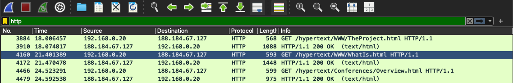

Перейдя на сайт в браузере `Google Chrome` на операционной системе `MacOS` и применив фильтр по протоколу `http` мы увидим следующее:
```
192.168.0.20	188.184.67.127	HTTP	568	GET /hypertext/WWW/TheProject.html HTTP/1.1 
188.184.67.127  192.168.0.20  HTTP  1088  HTTP/1.1 200 OK  (text/html)
```
TCP Stream:
```
GET /hypertext/WWW/TheProject.html HTTP/1.1
Host: info.cern.ch
Connection: keep-alive
Upgrade-Insecure-Requests: 1
User-Agent: Mozilla/5.0 (Macintosh; Intel Mac OS X 10_15_7) AppleWebKit/537.36 (KHTML, like Gecko) Chrome/140.0.0.0 Safari/537.36
Accept: text/html,application/xhtml+xml,application/xml;q=0.9,image/avif,image/webp,image/apng,*/*;q=0.8,application/signed-exchange;v=b3;q=0.7
Referer: http://info.cern.ch/
Accept-Encoding: gzip, deflate
Accept-Language: en-US,en;q=0.9,ru;q=0.8


HTTP/1.1 200 OK
Date: Fri, 19 Sep 2025 07:07:31 GMT
Server: Apache
Last-Modified: Thu, 03 Dec 1992 08:37:20 GMT
ETag: "8a9-291e721905000"
Accept-Ranges: bytes
Content-Length: 2217
Connection: close
Content-Type: text/html

<HEADER>
<TITLE>The World Wide Web project</TITLE>
<NEXTID N="55">
</HEADER>
<BODY>
<H1>World Wide Web</H1>The WorldWideWeb (W3) is a wide-area<A
NAME=0 HREF="WhatIs.html">
hypermedia</A> information retrieval
initiative aiming to give universal
access to a large universe of documents.<P>
Everything there is online about
W3 is linked directly or indirectly
to this document, including an <A
NAME=24 HREF="Summary.html">executive
summary</A> of the project, <A
NAME=29 HREF="Administration/Mailing/Overview.html">Mailing lists</A>
, <A
NAME=30 HREF="Policy.html">Policy</A> , November's  <A
NAME=34 HREF="News/9211.html">W3  news</A> ,
<A
NAME=41 HREF="FAQ/List.html">Frequently Asked Questions</A> .
<DL>
<DT><A
NAME=44 HREF="../DataSources/Top.html">What's out there?</A>
<DD> Pointers to the
world's online information,<A
NAME=45 HREF="../DataSources/bySubject/Overview.html"> subjects</A>
, <A
NAME=z54 HREF="../DataSources/WWW/Servers.html">W3 servers</A>, etc.
<DT><A
NAME=46 HREF="Help.html">Help</A>
<DD> on the browser you are using
<DT><A
NAME=13 HREF="Status.html">Software Products</A>
<DD> A list of W3 project
components and their current state.
(e.g. <A
NAME=27 HREF="LineMode/Browser.html">Line Mode</A> ,X11 <A
NAME=35 HREF="Status.html#35">Viola</A> ,  <A
NAME=26 HREF="NeXT/WorldWideWeb.html">NeXTStep</A>
, <A
NAME=25 HREF="Daemon/Overview.html">Servers</A> , <A
NAME=51 HREF="Tools/Overview.html">Tools</A> ,<A
NAME=53 HREF="MailRobot/Overview.html"> Mail robot</A> ,<A
NAME=52 HREF="Status.html#57">
Library</A> )
<DT><A
NAME=47 HREF="Technical.html">Technical</A>
<DD> Details of protocols, formats,
program internals etc
<DT><A
NAME=40 HREF="Bibliography.html">Bibliography</A>
<DD> Paper documentation
on  W3 and references.
<DT><A
NAME=14 HREF="People.html">People</A>
<DD> A list of some people involved
in the project.
<DT><A
NAME=15 HREF="History.html">History</A>
<DD> A summary of the history
of the project.
<DT><A
NAME=37 HREF="Helping.html">How can I help</A> ?
<DD> If you would like
to support the web..
<DT><A
NAME=48 HREF="../README.html">Getting code</A>
<DD> Getting the code by<A
NAME=49 HREF="LineMode/Defaults/Distribution.html">
anonymous FTP</A> , etc.</A>
</DL>
</BODY>
```
